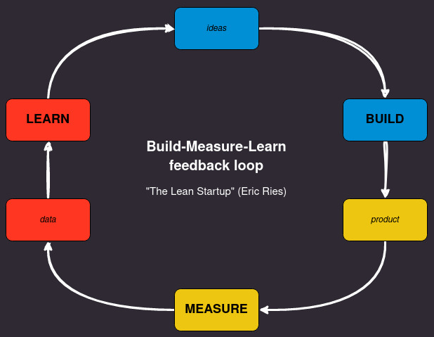

# Sentiment Analysis

---

<h2>Summary</h2>

- [0. Project Objectives](#0-project-objectives)
- [1. Solution Strategy](#1-solution-strategy)
- [2. Next Steps](#2-next-steps)

---

<h2>0. Project Objectives</h2>

In this project I focused much more on a recipe book for classic machine learning solutions for NLP tasks I followed several interesting subjects that I identified throughout my studies and to summarize all of this I developed some pipelines in pyspark and also made some comparisons with sentiment analysis with modern tools such as: Roberta, Chatgpt (GPT), LLAMA and Falcon ("Free Gpt alternative") all aimed at solving sentiment analysis.

In this small project I aim to train my skills with Spark on multiclass classification problems.

The project basically consists of sentiment analysis pipeline using kaggle dataset product reviews on this link: https://www.kaggle.com/datasets/snap/amazon-fine-food-reviews.

There is no strong business reason to solve any business problem involving the project, just for tool studies. The main goal is clean and preprocess text data and represents this text in a vector for classic machine learning for classify three different labels (bad, neutral and good) scores of this text vector representation.

I tried classic NLP methods like tokenization, StopWords, TD-IDF, etc. In "Next Steps", I mention some improvements that I would make to the code, but at this moment I will not apply them as we are working within a cyclical development method.

<h2>1. Solution Strategy</h2>

Following simple crisp / problem solving metodology i have splitted the steps of the solution in a image pipeline, for my first solution i have used classic NLP tools.

The first step is the *Data Cleaning*, in this step I have used spark for cleaning texts with regex and built-in transformations.

The second step is the *Tokenization*, is the step of taking the already cleaned text and separating it into tokens, which are a list of words or chunks of separate words.

The third step is the *StopWordsRemover*, simple remove stop words ("a", "is"...) for each token.

The fourth step is the *TF-IDF*, this tool computes a term (word) and document "frequencies", is a representation of text in numbers for machine learning.

The fifth step is the *Classifier*, this step involves training the estimator, performing cross validation techniques on the training and validation data, applying tuning and generating the final model to classify the test data.

<h2>2. Next Steps</h2>

There are other next steps and much work to do, that I will take in this project in future, for example:

1. Remove special characters in the text in order to have better performance in TF-IDF so that it eventually does not calculate wrong frequencies because of a special symbol.
2. Test other text to vec representations such as Word2Vec or another available on spark ml.
3. Apply dimensionality reducers such as SVC (sparce) to reduce dimensions (problem of high dimensions) and facilitate estimator learning.
4. Test with more training, validation and testing data (I have make a simple top K undersampling).
5. Productize the estimator with mlflow or another tool.
