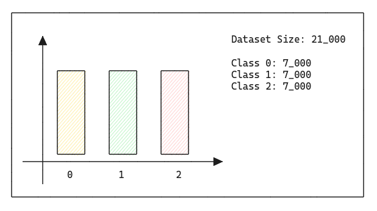
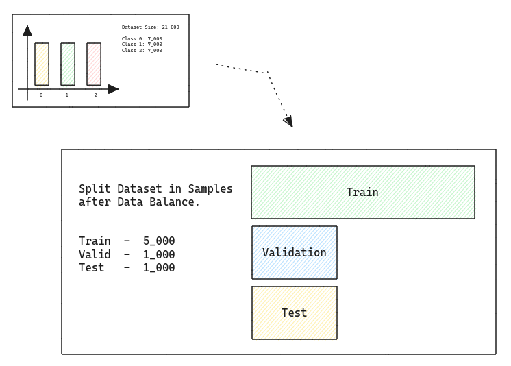

# Sentiment Analysis

---

<h2>Summary</h2>

- [0. Project Objectives](#0-project-objectives)
- [1. Solution Strategy](#1-solution-strategy)
- [2. Next Steps](#2-next-steps)

---

<h2>0. Project Objectives</h2>

In this project I focused much more on a recipe book for classic machine learning solutions for NLP tasks I followed several interesting subjects that I identified throughout my studies and to summarize all of this I developed some pipelines in pyspark and also made some comparisons with sentiment analysis with modern tools such as: Roberta, Chatgpt (GPT), LLAMA and Falcon ("Free Gpt alternative") all aimed at solving sentiment analysis.

In this small project I aim to train my skills with Spark on multiclass classification problems.

The project basically consists of sentiment analysis pipeline using kaggle dataset product reviews on this link: https://www.kaggle.com/datasets/snap/amazon-fine-food-reviews.

There is no strong business reason to solve any business problem involving the project, just for tool studies. The main goal is clean and preprocess text data and represents this text in a vector for classic machine learning for classify three different labels (bad, neutral and good) scores of this text vector representation.

I tried classic NLP methods like tokenization, StopWords, TD-IDF, etc. In "Next Steps", I mention some improvements that I would make to the code, but at this moment I will not apply them as we are working within a cyclical development method.

<h2>1. Solution Strategy</h2>

Following simple crisp / problem solving metodology i have splitted the steps of the solution in a image pipeline, for my first solution i have used classic NLP tools.

<b>The first step</b> is the *Data Cleaning*, in this step I have used spark for cleaning texts with regex and built-in transformations.

I will "sample" the dataset, i will start balancing the classes with 7_000 rows of each class, in a total of 21000 rows. In this dataset we have a min class size of 52635, I can random select 52635 examples for each class for random undersampling technique, but for now: "very small dataset".

After that, is the step of split the dataset into three distincts datasets on start of any data science / m.l study or real project. This datasets is used for fine tuning and test generalization of estimator.

1. Training - Training first spark ML estimator, and get scalers representations for future transform others datasets;
2. Validation - Valide training performance and tuning process on this dataset;
3. Testing - This slice of dataset is used to measure generalization in production;

<b>The second step</b> is the *Tokenization*, is the step of taking the already cleaned text and separating it into tokens, which are a list of words or chunks of separate words.

This is another stage of processing and cleaning the data.

First I separate the strings into "tokens" which are nothing more than a vector of words, this vector is used in the next class we will use, which is StopWordsRemover which in short will remove the stopwords.

Examples of stopwords is: "to, it, a", is considered noisy data in nlp tasks.

<b>The third step</b> is the *StopWordsRemover*, simple remove stop words ("a", "is"...) for each token.

<b>The fourth step</b> is the *TF-IDF*, this tool computes a term (word) and document "frequencies", is a representation of text in numbers for machine learning.

Now I need to take the text and transform into in a numerical vector. In pyspark exists two tools to do that.

1. Word2Vec;
2. TF-IDF / HashingTF;

First i will try TF-IDF, before is a good test to switch to word2vec and see the results.

After the previous data cleaning, now is the step of applying some form of numerical representation of the textual data. The most classic and simple is the TF-IDF tool which stands for "Term Frequency" and "Inverse Document Frequency". After you compute the TF-IDF scores for each term (word) in each document (vector of clean tokens), these scores reflect the importance of each term within the respective documents and can be used for various text analysis tasks.

<b>The fifth step</b> is the *Classifier*, this step involves training the estimator, performing cross validation techniques on the training and validation data, applying tuning and generating the final model to classify the test data. This is a very long step to work too, i have crated a Cross Validation K Fold manually because in pyspark do not exists a simple class to do that (only CrossValidator wich expects ParamGrid) and tuning with Hyperopt.

Now i will try to fit a machine learning model to receive a document vector from TF-IDF withous reducing dimensionality (check next steps) and produce a proba or classification for score label.

On my custom Cross Validation implementation in PySpark, i followed this steps to produce:

1. Random Sample Dataset into Train and Test;
2. Train dataset with Train sample and valid with Test;
3. Repeat K times;
4. Summarize Metrics;

But in multiclass problems, is impossible to random split, because you can imbalance classes, I will need to random split and have same classes proportions.

In first fold with default estimator i get this results:

After tuning, the metrics increased over 0.8%.

<b>Now for last step</b> i have created a PySpark pipeline with custom transform class for receive a completly raw data and get the classification of scores for deployment.

This is the all of my solution, i have post the notebook on kaggle to: https://www.kaggle.com/code/gabrielrichter/sentiment-analysis-with-pyspark

I have used LLMs in a another more simpler pipeline too, just for test hugging face models. This pipeline is describe on 04 notebook, with this pipeline i get litle more better results than previous steps using tf-idf, is very cool use this kind of solution for sentiment analysis.

Is just more simple. but have much work to do in next steps for this second solution. =D

<h2>2. Next Steps</h2>

There are other next steps and much work to do, that I will take in this project in future, for example:

1. Remove special characters in the text in order to have better performance in TF-IDF so that it eventually does not calculate wrong frequencies because of a special symbol.
2. Test other text to vec representations such as Word2Vec or another available on spark ml.
3. Apply dimensionality reducers such as SVC (sparce) to reduce dimensions (problem of high dimensions) and facilitate estimator learning.
4. Test with more training, validation and testing data (I have make a simple top K undersampling).
5. Productize the estimator with mlflow or another tool.
6. Try pyspark hugging face dataset support.