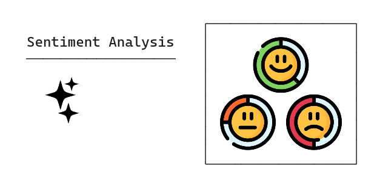
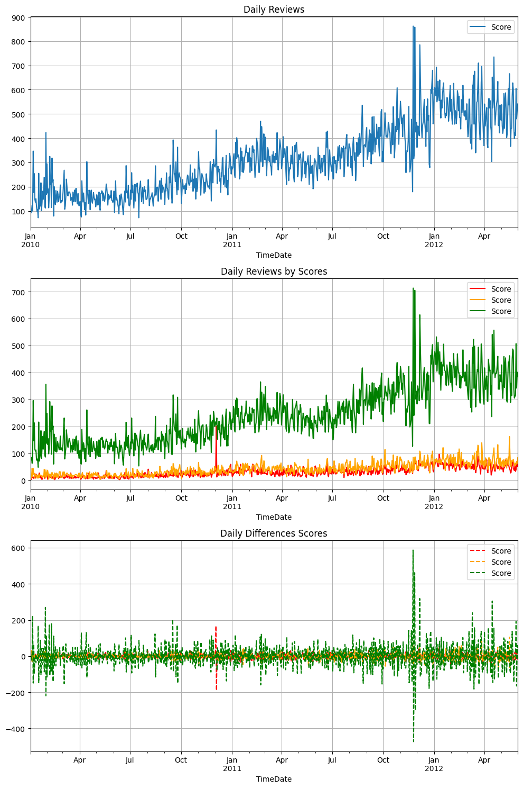
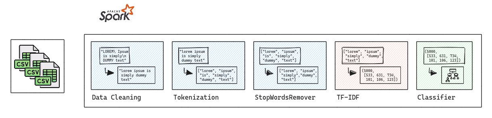
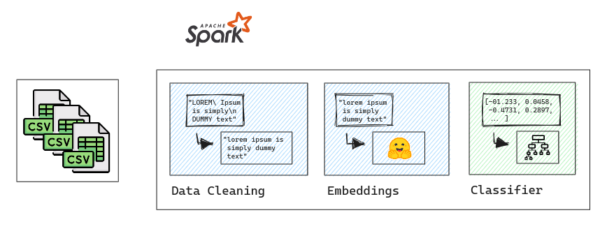

# Sentiment Analysis

---

---

### Summary

- [1.0. Business Problem](#10-bussiness-problem)
- [2.0. Solution Strategy](#20-solution-strategy)
  - [2.1. Problem Solving Methodology](#21-problem-solving-methodology)
  - [2.2. The Workflow](#22-the-workflow)
- [3.0. Descriptive Statistical](#30-descriptive-statistical)
  - [3.1. Split Dataset](#31-split-dataset)
  - [3.2. Dataset Overview](#32-dataset-overview)
- [4.0. Sentiment Analysis](#40-sentiment-analysis)
  - [4.1. Classical NLP](#41-classical-nlp)
  - [4.2. Hugging Face](#42-hugging-face)
- [5.0. Next Steps](50-next-steps)

---

## 1.0. Business Problem

---

**Business Overview**: You are working at Foods Inc as a data analyst. The company is a chain of sophisticated restaurants in Brazil and is expanding rapidly, also operating in the Uruguay and Paraguay segments.
The company is currently in the process of modernizing technologies and processes, the company's main focus now is to target customers and products, one of the company's biggest updates is the creation of an online application that works like an "online restaurant", the customer Create an account on the app and order food, after that the restaurant creates food and sends it to the customer's home.
A very simple e-commerce, but for food.
By creating an account, customers can order any type of food available from restaurants near their location. After that, the restaurant creates the order and delivery the food to the customer location, the customer can provide post delivery feedback and a star rating.

**Business Problem**: This application has been running for a year and the company has collected some raw data and now its challenge is to provide insights with this data set.
One of the main objectives is to create an estimator that works as a validator of sentiment scores.
If the score is 5 and the text is "very bad", you will need to confirm this score with an estimator.

## 2.0. Solution Strategy

---

I created two main cycles in this dataset. The README of the second cycle (more recent) I will write below, the difference between first and second cycles is in the simplicity of pyspark code and tests.

In this small project I aim to train my skills with Spark on multiclass classification problems.
The project basically consists of sentiment analysis pipeline and descriptive statistical & EDA analysis using kaggle dataset product reviews on this link: https://www.kaggle.com/datasets/snap/amazon-fine-food-reviews.

This dataset consists of reviews of fine foods from amazon. The data span a period of more than 10 years, including all ~500,000 reviews up to October 2012. Reviews include product and user information, ratings, and a plain text review. It also includes reviews from all other Amazon categories.

Dataset Overview:

- *Id*: Row Number.
- *ProductId*: Product that customer buy at a restaurant.
- *UserId*: Customer indentification.
- *ProfileName*: Customer Profile.
- *Time*: Feedback timestamp.
- *HelpfulnessNumerator|HelpfulnessDenominator*: Indicators.
- *Score*: Sentiment.
- *Summary*: A summary of text.
- *Text*: Customer feedback.

### 2.1. Problem Solving Methodology

I have CRISP in my toolkit for rapid development of solutions and problem solving techniques, based on this, the author "Eric Ries" has a phrase in the book lean startup, "Vision leads to direction" and shows a cyclical process for startup fast projects solutions and can be applied to data science projects too.

### 2.2. The Workflow

In this project i do not build a data engineering and deployment setup, i follow much more a pipeline using Apache Spark of analysis to describe the dataset, find inconsistency and some key points in reviews of amazon dataset, after that i build two main pipelines for sentiment analysis, one using classical nlp tasks and tfidf, a second using huggingface transformers (minilm) for embeddings, with this embeddings is possible to create clusters and visualize a high dimensional feature space of texts and compare between tfidf and transformers. With this texto to number representation i used a simple logistic regression from PySpark for sentiment scores.

In this small project I aim to train my skills with Spark on multiclass classification problems and descriptive statistical.

The project basically consists of sentiment analysis pipeline using kaggle dataset product reviews on this link: https://www.kaggle.com/datasets/snap/amazon-fine-food-reviews.

This dataset consists of reviews of fine foods from amazon. The data span a period of more than 10 years, including all ~500,000 reviews up to October 2012. Reviews include product and user information, ratings, and a plain text review. It also includes reviews from all other Amazon categories.

Dataset Overview:

- *Id*: Row Number.
- *ProductId*: Product that customer buy at a restaurant.
- *UserId*: Customer indentification.
- *ProfileName*: Customer Profile.
- *Time*: Feedback timestamp.
- *HelpfulnessNumerator|HelpfulnessDenominator*: Indicators.
- *Score*: Sentiment.
- *Summary*: A summary of text.
- *Text*: Customer feedback.

## 3.0. Descriptive Statistical

---

### 3.1. Split Dataset

Before starting the work on descriptive statistical I train test split the dataset into Train, Test and OOT datasets.
In start of project when i splitting the dataset i find some key problems related to the target feature.

In this step, I will split into training and testing datasets and created a function to fix the scores into three main categories (bad, neural, and good).

For train test split I will consider three datasets.

- OOT: Out of Time (Time shift dataset for sentiment in future).
- Train Dataset: Dataset for train Estimators and Exploratory.
- Test Dataset: Dataset for train estimators.

In real life, the customer behavior of sentiment changes, is possible to capture a product quality over time and customer sentiment over time, in a production scenario the OOT is very important because is a shift behavior of the estimation purposes.

But there are some noisy data in both profile scores and names, such as noisy scores and strange names.

In the dataset exists stranges Scores and scores greather than 5 (the current scores is between 0 and 5), i just filter this rows because is a problem in my target feature, is possible to see a pattern in this rows, all is with "inconsistent profile names".

Another problem i have find is in context of Time column.

Is very strange, exists reviews below 20's. I will consider reviews only greather or equal to 2003. This dataset is from Amazon, Amazon is created at 1994, but i will give a greather time gap for filter this reviews, is possible to check this reviews with data engineering team of amazon if this make sense, can be a error in time input of ETL process or a bug in moment of the customer create a review in amazon app or website, same for inconsistent Scores.

In My business Problem i assume the Foods Inc is created in 19's too, but start working and having high relevance after 2003.

The descriptive statistis I used the TRain dataset.

- Number of Rows: 373745 in train.
- Number of Columns: 10 in train.

### 3.2. Dataset Overview

I will resume some key points. Mode details at this notebook: [descriptive statistics notebook](notebooks/second_cycle/grc_descriptive_statistics.ipynb).

Exists a total of 57289 unique products and 181633 unique customers, with 158747 unique profile names, exists customers with the same profile name but with different UserId and a umbalanced dataset.

Is possible to see profile names with special words (chars) and strange usersId such as "#oc-R10LT57ZGIB140".

Another observations is in Profile Name, exists duplicated profile names, its Ok, but chan change descriptive statistics overview, i consider UserId and profile name too.

|profileName                               |count|
|------------------------------------------|-----|
|"O. Brown ""Ms. O. Khannah-Brown"""       |338  |
|"C. F. Hill ""CFH"""                      |314  |
|"Rebecca of Amazon ""The Rebecca Review"""|274  |
|Gary Peterson                             |225  |
|Chris                                     |218  |
|c2                                        |180  |
|Linda                                     |180  |
|Laura                                     |177  |
|Gunner                                    |168  |
|Lisa                                      |164  |
|christopher hayes                         |164  |
|Stephanie                                 |164  |
|John                                      |159  |
|Jen                                       |154  |
|Mike                                      |153  |
|Karen                                     |150  |
|Jared Castle                              |143  |
|David                                     |142  |
|"Lynrie ""Oh HELL no"""                   |141  |
|Fran W.                                   |139  |

I have check the UserId, Products and Profile name, with a very simple proportion i check that 0.002 or 0.2 % of reviews is duplicated based on UserId, ProductId, Text and Score.

For example, this user: "vegancompassion ""anattanupassana""" with Id: "A1LZJZIHUPLDV4" have only duplicated reviews, the same review in same product and different products.

Is possible to see a anomaly in December. Maybe is the crazy customer with duplicated reviews. The daily time series do not show any pattern, just a smooth up trend. Is possible to see another anomaly in negative reviews at december of 2010.

The main ideia with this plot is to check some anomaly or pattern over time.

## 4.0. Sentiment Analysis

---

In this step I will create two main solution.

- A sentiment analysis with traditional machine learning using TF-IDF and a second solution with hugging face transformers embedding, after feature extraction with TF-IDF and Embeddings I selected a Random Forest estimator to create probability Scores for each class of sentiment.

- The second solution is using pyspark and huggingface embeddings instead of traditional tfidf.

But before starting work on Sentiment, i need to balance the classes, i selected random undersampling.

Sampling methods seem to be the dominate type of approach in the community as they tackle imbalanced learning in a straightforward manner. In general, the use of sampling methods in imbalanced learning consists of the modification of an imbalanced dataset by some mechanism in order to provide a balanced distribution. Representative work in this area includes random oversampling, random undersampling, synthetic sampling with data generation, cluster-based sampling methods, and integration of sampling and boosting.

The key aspect of sampling methods is the mechanism used to sample the original dataset. Under different assumptions and with different objective considerations, various approaches have been proposed. For instance, the mechanism of random oversampling follows naturally from its description by replicating a randomly selected set of examples from the minority class. On the basis of such simple sampling techniques, many informed sampling methods have been proposed, such as the EasyEnsemble and BalanceCascade algorithms. Synthetic sampling with data generation techniques has also attracted much attention.

### 4.1. Classical NLP

Notebook: [modelling tfidf notebook](notebooks/second_cycle/grc_modelling_tfidf_logistic.ipynb).

For classical TF-IDF solution, exists is another stages of processing and cleaning the data. First I separate the strings into "tokens" which are nothing more than a vector of words, this vector is used in the next class we will use, which is StopWordsRemover which in short will remove the stopwords. Examples of stopwords is: "to, it, a", is considered noisy data in nlp tasks.

With clean data and tokens generated, now I need to take the text and transform into in a numerical vector. In pyspark exists two tools to do that.

1. Word2Vec;
2. TF-IDF / HashingTF;

First i will try TF-IDF, before is a good test to switch to word2vec.

After the previous data cleaning, now is the step of applying some form of numerical representation of the textual data.
The most classic and simple is the TF-IDF tool which stands for "Term Frequency" and "Inverse Document Frequency".

W. Recall: 0.7607
W. Precision: 0.8254

Label: 0, Recall: 0.4954
Label: 0, Precision: 0.6755

Label: 1, Recall: 0.3565
Label: 1, Precision: 0.5755

Label: 2, Recall: 0.9496
Label: 2, Precision: 0.8038

Mean Recalls: 0.6849, Mean Precisions: 0.6005

### 4.2. Hugging Face

Notebook: [modelling tfidf notebook](notebooks/second_cycle/grc_modelling_huggingface_pyspark.ipynb).

In this step i have tested two main solution to deal with Hugging face, memory and PySpark.

The first solution is using a using a batch UDF, but is very complex and computational expensive. (https://spark.apache.org/docs/3.4.0/api/python/reference/api/pyspark.ml.functions.predict_batch_udf.html), its took +600 seconds and with a high memory consumption (+10GB) to deal with 3.000 rows, after i cached the dataframe.

Another approach i have tested is to collect id and sentences to driver, its reduced a lot memory usage during process and speed up the process, is possible to see on hugging face forum a solution with python yeald instead of collect, maybe the better ideia is to use any type of transformers in scala to not lose processing time between udf and collect into driver.

In OOT i get this metrics:

W. Recall: 0.7596
W. Precision: 0.8286

Label: 0, Recall: 0.4777
Label: 0, Precision: 0.7348

Label: 1, Recall: 0.3583
Label: 1, Precision: 0.5539

Label: 2, Recall: 0.9558
Label: 2, Precision: 0.7982

Mean Recalls: 0.6956, Mean Precisions: 0.5973

## 5.0. Next Steps

---

I will try more methods with tfidf with pyspark, such as PCA to see if exists some possible clusters on dataset, same for hugging face embeddings, if i not se any, i need to check all my text processing (that i used only simple sql and regex to clean) and try more deep cleaning in this dataset.