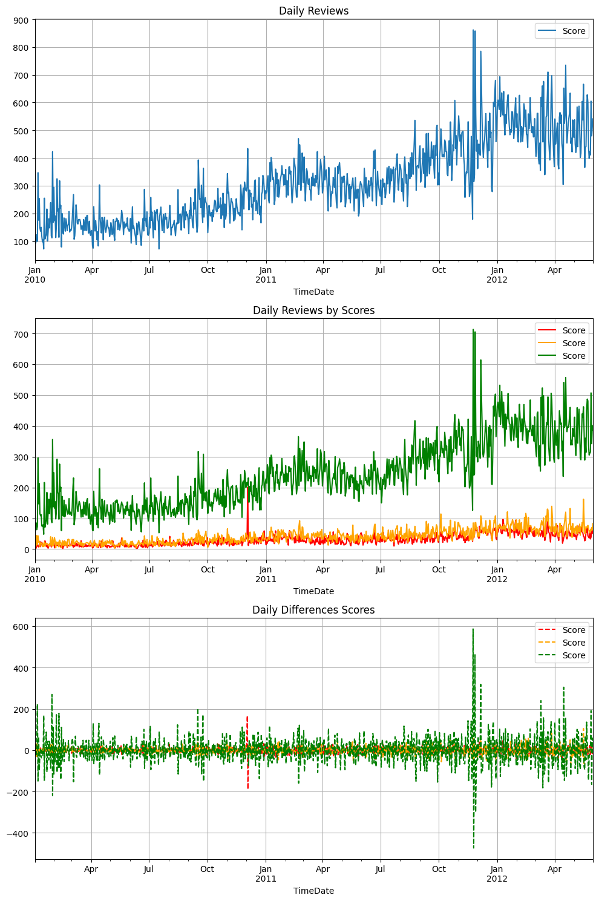

---
hide:
  - navigation
---

## Detalhes Encontrados

---

Antes de iniciar o trabalho com estatística descritiva eu divido o conjunto de dados em conjuntos de dados de Treinamento, Teste e OOT. No início do projeto, ao dividir o conjunto de dados, encontrei alguns problemas importantes relacionados a coluna target (alvo) para a solução da análise de sentimento, que para esse caso de uso é a coluna chamada de Score.

Nesta etapa de separação do conjunto de dados dividirei os conjuntos de dados em conjuntos de dados de treinamento e teste e criarei uma função para fixar as pontuações em três categorias principais (ruim, neural e bom).

Para a divisão de treinamento e teste, considerarei três conjuntos de dados.

- OOT: Fora do Tempo, consite em um conjunto de dados com deslocamento temporal para sentimento no futuro.
- Conjunto de Dados de Treinamento: Conjunto de dados para Estimadores de Treinamento e Exploratório.
- Conjunto de Dados de Teste: Conjunto de dados para estimadores de Treinamento.

Na vida real o comportamento do cliente em relação ao sentimento muda, é possível capturar a qualidade do produto ao longo do tempo e o sentimento do cliente ao longo do tempo, em um cenário de produção o conjunto de dados OOT é muito importante porque é um conjunto de dados que vou garantir o comportamento de mudança para fins de estimativa no futuro, ou seja, "como está o sentimento das reviews mais fresquinhas".

Durante a etapa de separação en treino e teste e OOT identifiquei potenciais problemas relacionados a qualidade dos dados, alguns registrso descartei devido a ser ruído na base de dados.

No conjunto de dados, existem pontuações estranhas e pontuações maiores que 5 (as pontuações atuais estão entre 0 e 5). Eu apenas filtro essas linhas porque há um problema no meu recurso de destino. É possível ver um padrão nessas linhas, todas com "nomes de perfil inconsistentes".

Outro problema que encontrei está no contexto da coluna "Tempo", é muito estranho, existem avaliações abaixo de 20 anos, considerarei apenas avaliações maiores ou iguais a 2003. Este conjunto de dados é da Amazon e ela foi que foi criada em 1994, mas darei um intervalo de tempo maior para filtrar essas avaliações. É possível verificar essas avaliações com a equipe de engenharia de dados da Amazon se isso fizer sentido, por qual motivo existem avaliações antes do surgimento da empresa, podemos assumir isso como sendo um erro na entrada de tempo do processo de ETL ou um bug no momento em que o cliente cria uma avaliação no aplicativo ou site da Amazon, o mesmo vale para pontuações inconsistentes.

Para o problema de negócio atual proposto no projeto, presumo que a Foods Inc. também foi criada na década de 19, mas começou a funcionar e a ter alta relevância após 2003.

## Estatística Descritiva

---

Para as estatísticas descritivas, utilizei o conjunto de dados de treinamento.

Número de linhas: 373.745 no trem.
Número de colunas: 10 no trem.
3.2. Visão geral do conjunto de dados
Resumirei alguns pontos-chave. Detalhes do modo neste caderno: caderno de estatísticas descritivas.

Existe um total de 57.289 produtos exclusivos e 181.633 clientes exclusivos, com 158.747 nomes de perfil exclusivos. Existem clientes com o mesmo nome de perfil, mas com IDs de usuário diferentes e um conjunto de dados desbalanceado.

É possível ver nomes de perfil com palavras especiais (caracteres) e IDs de usuário estranhos, como "#oc-R10LT57ZGIB140".

Outra observação é que no Nome do Perfil existem nomes de perfil duplicados. Até ai tudo bem, mas posso alterar a visão geral das estatísticas descritivas. Considero também o ID do Usuário e o nome do perfil.

|profileName                               |count|
|------------------------------------------|-----|
|"O. Brown ""Ms. O. Khannah-Brown"""       |338  |
|"C. F. Hill ""CFH"""                      |314  |
|"Rebecca of Amazon ""The Rebecca Review"""|274  |
|Gary Peterson                             |225  |
|Chris                                     |218  |
|c2                                        |180  |
|Linda                                     |180  |
|Laura                                     |177  |
|Gunner                                    |168  |
|Lisa                                      |164  |
|christopher hayes                         |164  |
|Stephanie                                 |164  |
|John                                      |159  |
|Jen                                       |154  |
|Mike                                      |153  |
|Karen                                     |150  |
|Jared Castle                              |143  |
|David                                     |142  |
|"Lynrie ""Oh HELL no"""                   |141  |
|Fran W.                                   |139  |

Verifiquei o ID do Usuário, os Produtos e o Nome do Perfil. Com uma proporção bem simples, verifiquei que 0,002 ou 0,2% das avaliações são duplicadas com base no ID do Usuário, ID do Produto, Texto e Pontuação.

Por exemplo, este usuário: "vegancompassion ""anattanupassana""" com ID: "A1LZJZIHUPLDV4" tem apenas avaliações duplicadas, a mesma avaliação para o mesmo produto e produtos diferentes.

É possível observar uma anomalia em dezembro de acordo com a série temporal apresentada na imagem, podemos assumir que possa ser o cliente doido com as suas avaliações duplicadas.
A série temporal diária não mostra nenhum padrão, apenas uma tendência ascendente suave. Além disso é possível observar outra anomalia nas avaliações negativas em dezembro de 2010.

