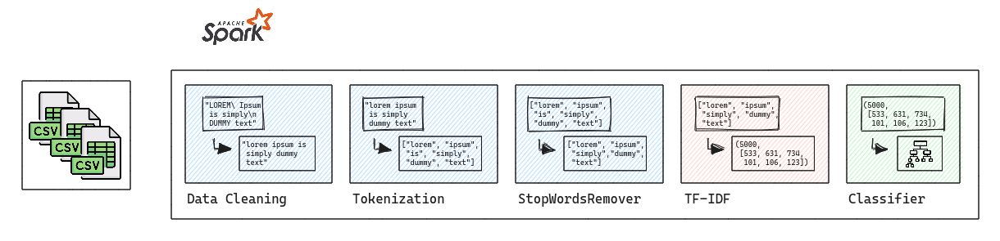

Primeiramente a solução inicial foi a abordagem clássica de contagens e frequências de palavras, essa abordagem é o TF-IDF, detalhei todo o mecanismo do TF-IDF no notebook na pasta notebooks do repositório do projeto.

Em resumo, essa solução consiste na contagem de frequencias e palavras de cada frase, o calculo consiste no "Term Frequency" e "Inverse Term Frequency", dessa forma é possível obter uma representação numérica das palavras em cada frase e além disso essas frequencias refletem a importância de cada termo na frase. 

Para a solução clássica de TF-IDF é necessário existem outras etapas de processamento e limpeza dos dados preliminar pois posso estar contando sujeira ou palavras que não deveriam ser contadas, essas palavras ou erros de digitação podem aumentar o espaço vetorial da representação da frase.

A primeira etapa de processamento de dados eu separo as strings em "tokens", que nada mais são do que um vetor de palavras, esse vetor é usado na próxima classe que usaremos, StopWordsRemover, que, resumidamente, removerá as stopwords, ou seja,exemplos de stopwords são: "to, it, a", que são considerados dados com ruído em tarefas de PNL clássicas.

Com os dados limpos e os tokens já selecionados agora preciso pegar o texto e transformá-lo em um vetor numérico para aplicar a modelagem de Machine Learning para a perspectiva de Análise de Sentimento.

Para tais fins, utilizarei novamente o PySpark, com essa ferramenta dentro do pacote MLLib existem duas ferramentas para transformar uma palavra em representação numérica, irei seguir pela segunda opção.

- Word2Vec;
- TF-IDF / HashingTF;

Após a limpeza de dados anterior, agora é a etapa de aplicar alguma forma de representação numérica aos dados textuais. A mais clássica e simples é a ferramenta TF-IDF, que significa "Frequência de Termos" e "Frequência Inversa de Documentos" que vai ser a selecionada para darmos sequência na solução.

Por fim, apliquei algorítimos de machine learning utilizando o PySpark e obtive as seguintes métricas de avaliação:

- W. Recall: 0,7607 W. Precisão: 0,8254
- Rótulo: 0, Recall: 0,4954 Rótulo: 0, Precisão: 0,6755
- Rótulo: 1, Recall: 0,3565 Rótulo: 1, Precisão: 0,5755
- Rótulo: 2, Recall: 0,9496 Rótulo: 2, Precisão: 0,8038
- Médias de Recall: 0,6849, Precisões Médias: 0,6005