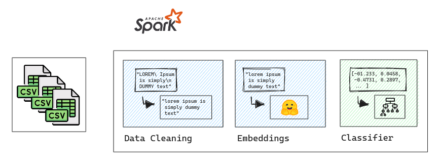

A segunda solução para o desenvolvimento do projeto foi a utilização de LLM's para a extração de Sentimento e também dos vetores que fazem a representação dos dados textuais em números.

Para essa segunda solução considerarei um pipeline de dados traducional fazendo a extração dos embeddings que nada mais é que a representação textual das frases em numeros para posteriormente aplicalas em algoritimos de machine learning tradicionais.

Eu mantive toda a limpeza dos dados anteriormente já realizadas, entretanto isso pode perder o contexto para a representação dos embeddings, pois analisei alguns forums e papers a respeito do tema e os algoritimos de Large Language Models "preferem" os textos em seu formato tradicional, sem a remoção de stopwords nem conversão para tudo minúsculo e maíusculo, mas o importante é remover os códigos HTML ou quaiquer outras "sujeiras" do conjunto de dados, mais precisamente das frases de usuários pois é um campo aberto, o usuário pode escrever oque quiser.

O maior desafio foi utilizar o PySpark com LLM's, deixei vários testes dentro dos notebooks a fim de tentar identificar melhores soluções, desde Pandas UDF com PyArrow até paralelismo horizontal.

- W. Recall: 0,7596 W. Precisão: 0,8286
- Rótulo: 0, Recall: 0,4777 Rótulo: 0, Precisão: 0,7348
- Rótulo: 1, Recall: 0,3583 Rótulo: 1, Precisão: 0,5539
- Rótulo: 2, Recall: 0,9558 Rótulo: 2, Precisão: 0,7982
- Médias de Recall: 0,6956, Precisões Médias: 0,5973