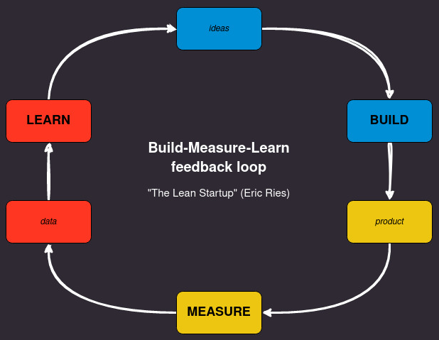

---
hide:
  - navigation
---

## O Conjunto de Dados

---

Para solucionar o problema de negócio eu fiz duas entregas, uma primeira entrega apelidei de primeiro ciclo e a segunda entrega de segundo ciclo.

Neste pequeno projeto, pretendo treinar minhas habilidades com o Spark em problemas de classificação multiclasse, o projeto consiste basicamente em um pipeline de análise de sentimentos, análise estatística descritiva e análise de dados de produtos (EDA) usando o conjunto de dados do Kaggle, com avaliações de produtos disponíveis neste link: https://www.kaggle.com/datasets/snap/amazon-fine-food-reviews.

Este conjunto de dados consiste em avaliações de alimentos finos da Amazon, os dados abrangem um período de mais de 10 anos, incluindo todas as cerca de 500.000 avaliações até outubro de 2012. As avaliações incluem informações sobre o produto e o usuário, classificações e uma avaliação em texto simples e também inclui avaliações de todas as outras categorias da Amazon.

## Visão Geral do Dataset

---

- Id: Número da linha.
- ProductId: Produto que o cliente compra em um restaurante.
- UserId: Identificação do cliente.
- Nome do Perfil: Perfil do Cliente.
- Hora: Carimbo de data/hora do feedback.
- Numerador de Utilidade | Denominador de Utilidade: Indicadores.
- Pontuação: Sentimento.
- Resumo: Um resumo do texto.
- Texto: Feedback do cliente.

## Metodologia de Resolução de Problemas

---

Tenho o CRISP em meu kit de ferramentas para desenvolvimento rápido de soluções e técnicas de resolução de problemas. Com base nisso, o autor "Eric Ries" tem uma frase no livro Lean Startup, "Visão leva à direção", que mostra um processo cíclico para soluções de projetos rápidos de startups, que também pode ser aplicado a projetos de ciência de dados.

## Estratégia de Solução

---

Neste projeto, não crio uma configuração de engenharia e implantação de dados; sigo muito mais um pipeline de análise usando o Apache Spark para descrever o conjunto de dados, encontrar inconsistências e alguns pontos-chave nas avaliações do conjunto de dados da Amazon. Em seguida, construo dois pipelines principais para análise de sentimentos: um usando tarefas clássicas de PNL e TFIDF; o segundo, usando transformadores Huggingface (Minilm) para embeddings. Com esses embeddings, é possível criar clusters e visualizar um espaço de recursos de textos de alta dimensão, além de comparar entre TFIDF e transformadores. Com essa representação de texto para número, usei uma regressão logística simples do PySpark para pontuações de sentimentos.

Neste pequeno projeto, pretendo treinar minhas habilidades com o Spark em problemas de classificação multiclasse e estatística descritiva.

O projeto consiste basicamente em um pipeline de análise de sentimentos usando avaliações de produtos do conjunto de dados do Kaggle neste link: https://www.kaggle.com/datasets/snap/amazon-fine-food-reviews.